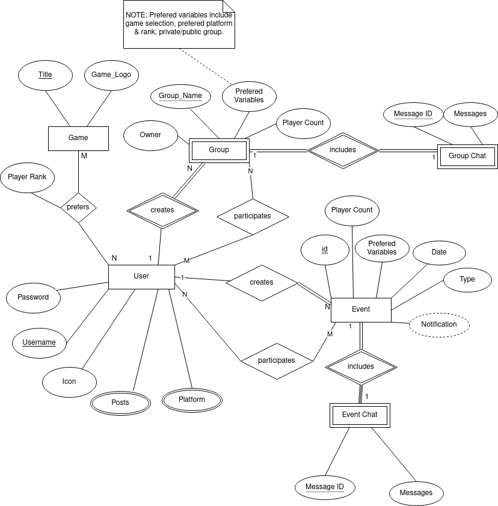
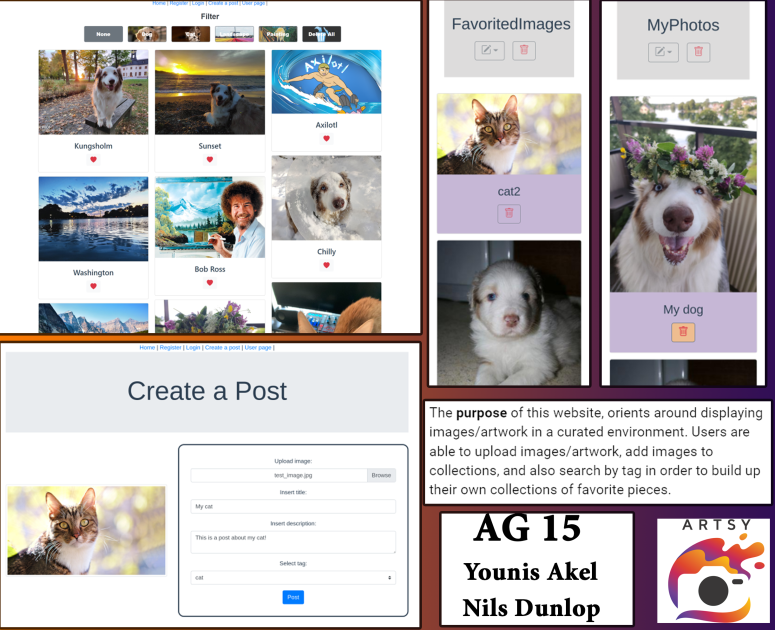

# Backend and Frontend Template

Latest version: https://git.ita.chalmers.se/courses/dit341/group-00-web (public Github [mirror](https://github.com/dit341/group-00-web))

## Project Structure

| File                                                 | Purpose                           | What you do?                              |
| ---------------------------------------------------- | --------------------------------- | ----------------------------------------- |
| `server/`                                            | Backend server code               | All your server code                      |
| [server/README.md](server/README.md)                 | Everything about the server       | **READ ME** carefully!                    |
| `client/`                                            | Frontend client code              | All your client code                      |
| [client/README.md](client/README.md)                 | Everything about the client       | **READ ME** carefully!                    |
| [docs/DEPLOYMENT.md](docs/DEPLOYMENT.md)             | Free online production deployment | Deploy your app online in production mode |
| [docs/LOCAL_DEPLOYMENT.md](docs/LOCAL_DEPLOYMENT.md) | Local production deployment       | Deploy your app local in production mode  |

## Requirements

The version numbers in brackets indicate the tested versions but feel free to use more recent versions.
You can also use alternative tools if you know how to configure them (e.g., Firefox instead of Chrome).

- [Git](https://git-scm.com/) (v2) => [installation instructions](https://www.atlassian.com/git/tutorials/install-git)
  - [Add your Git username and set your email](https://docs.gitlab.com/ce/gitlab-basics/start-using-git.html#add-your-git-username-and-set-your-email)
    - `git config --global user.name "YOUR_USERNAME"` => check `git config --global user.name`
    - `git config --global user.email "email@example.com"` => check `git config --global user.email`
  - > **Windows users**: We recommend to use the [Git Bash](https://www.atlassian.com/git/tutorials/git-bash) shell from your Git installation or the Bash shell from the [Windows Subsystem for Linux](https://docs.microsoft.com/en-us/windows/wsl/install-win10) to run all shell commands for this project.
- [Chalmers GitLab](https://git.ita.chalmers.se/) => Login with your **Chalmers CID** choosing "Sign in with" **Chalmers Login**. (contact [support@chalmers.se](mailto:support@chalmers.se) if you don't have one)
  - DIT341 course group: https://git.ita.chalmers.se/courses/dit341
  - [Setup SSH key with Gitlab](https://docs.gitlab.com/ee/ssh/)
    - Create an SSH key pair `ssh-keygen -t ed25519 -C "email@example.com"` (skip if you already have one)
    - Add your public SSH key to your Gitlab profile under https://git.ita.chalmers.se/profile/keys
    - Make sure the email you use to commit is registered under https://git.ita.chalmers.se/profile/emails
  - Checkout the [Backend-Frontend](https://git.ita.chalmers.se/courses/dit341/group-00-web) template `git clone git@git.ita.chalmers.se:courses/dit341/group-00-web.git`
- [Server Requirements](./server/README.md#Requirements)
- [Client Requirements](./client/README.md#Requirements)

## Getting started

```bash
# Clone repository
git clone git@git.ita.chalmers.se:courses/dit341/group-00-web.git

# Change into the directory
cd group-00-web

# Setup backend
cd server && npm install
npm run dev

# Setup frontend
cd client && npm install
npm run serve
```

> Check out the detailed instructions for [backend](./server/README.md) and [frontend](./client/README.md).

## Visual Studio Code (VSCode)

Open the `server` and `client` in separate VSCode workspaces or open the combined [backend-frontend.code-workspace](./backend-frontend.code-workspace). Otherwise, workspace-specific settings don't work properly.

## System Definition (MS0)

### Purpose

With this website, the focus orients around displaying images/artwork in a curated environment. Users are able to upload images/artwork, add images to collections, and also search by tag in order to build up their own collections of favorite pieces. 

### Pages

- **Registration page:** On the registration page creation of a user is done by creating a username, password, bio about themselves, and uploading a user icon. Upon creation, the user's two default collections (MyPhotos and FavoritedImages) are added to the user. After creating an account the user is then redirected to the “Log-in page.”

- **Log-in:** On the log-in page, the user can input the username and password that they have previously created. Upon successfully logging in a JWT WebToken is set to the user to initiate a session and then the user is redirected to the “Home page.” If the user does not have an account, they have the option to be redirected to the registration page.

- **Home page:** On the home page, a user is displayed with all the user-uploaded images. Below each image, there is a heart icon which upon user click will add the selected image to their FavoritedImages collection. At the top of the homepage, the user is presented with an image filtering system. The filtering system works using the user-selected image tags when uploading an image. Therefore, the filtering options are as follows: none, cat, dog, landscape, and painting photos. Upon a filtering option selected the user view is updated to only show the images that are related to the associated selected tag. Lastly, in the top right, the user has also the option to delete all photos to clear the homepage view if wanted. 

- **User page:** The user page contains details on the user, such as their username, user icon, and bio. The user specific collections are shown on their page. Each user has default collections one containing all their uploaded posts and another collection containing their favorite posts. The collections have a default folder icon presented on them.

- **Post creation page:** In the post creation page, a user is able to upload an image; after which, the uploaded image is displayed/previewed to the user. Next, users must add post criteria to submit their new post which include: add a title, add a description, add related tags. After uploading an image the image is automatically added to the users MyPhotos collections in the user page. 

- **Inside a collection page:** When a user enters a collection from the user page, posts within that collection will be visible. In the MyPhotos collection that contains posts that the user uploaded, the user can select to delete their posts. The FavoritedImages collection will contain posts that the user has favorited. The user is not able to delete posts from the FavoritedImages collection, since they may be posts from other users. Functionality regarding editing a user created collection has also been implemented. This would mainly enable for and support future implementations of allowing users to create their own collections, and involves ensuring that the current logged in user actually has permissions to modify that particular collection. 

### Entity-Relationship (ER) Diagram



## Teaser (MS3)


### Teaser video
[](https://youtu.be/EP0KQcu8TLc)
